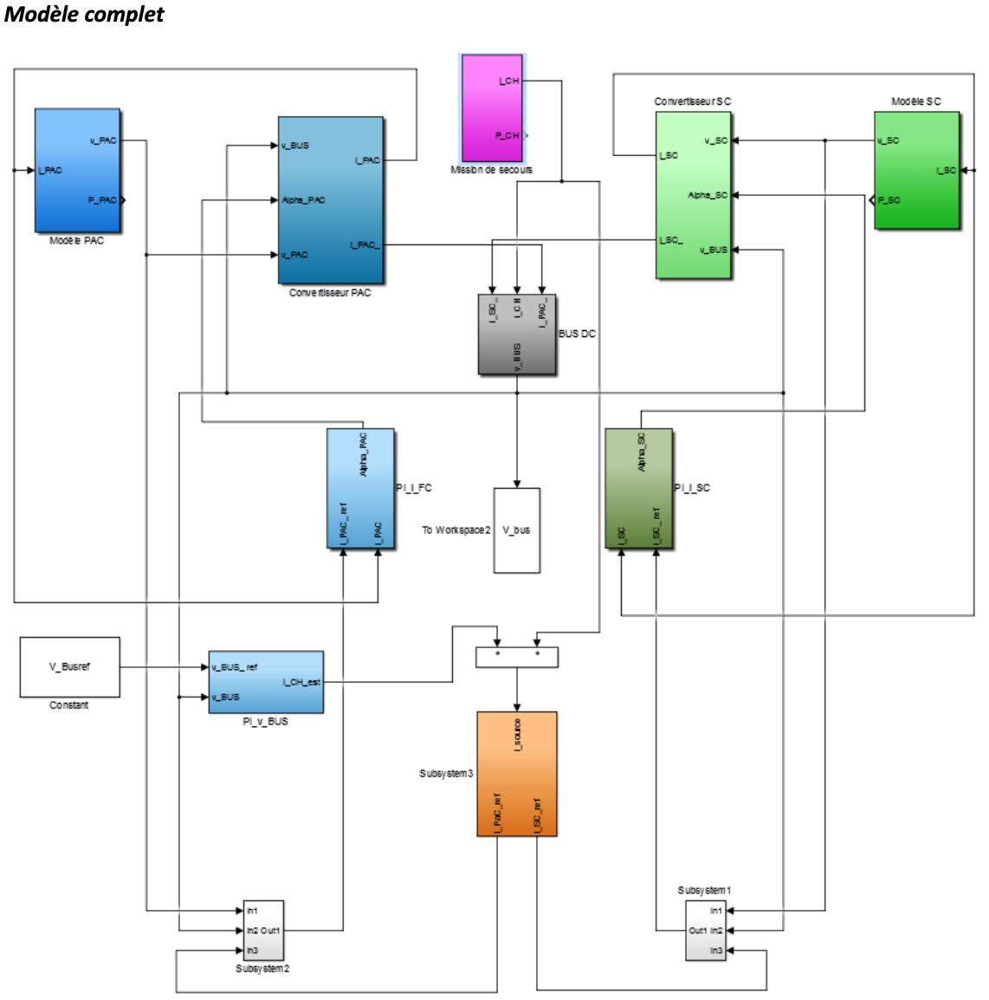

# Engineering study: Power Supply alternative to Ram Air Turbines in Aircrafts *(RAT)*

This project is my work on a use case for **"Embedded Electrical Power Management"** as a 5th Year **Engineering student at ESTACA**

## Abstract

Ram Air Turbine is a system widely used in Aircraft as emergency power supplies. It is usually scaled to provide enough energy for basic flight control in case of a total power failure. It is a small wind turbine connected to a hydraulic pump or an electrical generator. But as energy management develops trough the year and weight optimization is crucial in aircrafts, alternatives to a complete wind turbine just for an emergency could be a really good asset.

This project aims to scale and model a solution toward replacing RAT by a hybrid power supply with both Hydrogen fuel cells for nominal energy needs and Super Capacitors for spikes. The goal is to scale both energy sources and distribute load according to what each power supply is good to add (nominal load or spikes) with the best performances.

## Table of contents

### A.    Conversion chain study

- I. Specification analysis
	- 1. Power/Current mission profile
	- 2. Profile characteristics
	- 3. Results Analysis

- II. Hybrid power supply with Hydrogen Fuel Cells/Super Capacitor
	- 1. Power supply components scaling
	- 2. Results analysis

- III. Modeling and Simulation

### B. Control strategy and Power Management
-	I. Lowpass filter scaling for control
-	II. Performance results
-	III. Conclusion

## Power Supply Model

